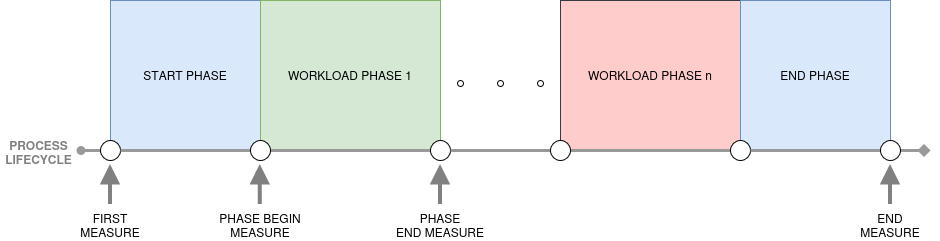

  

# Introduction

**Joule Profiler** is a tool for measuring program metrics from various sources, such as RAPL, perf_event or NVML, with a focus on energy consumption. You can see the implemented sources list in the [sources](sources/overview.md) section. It supports CPU and GPU profiling, and provides other system metrics at multiple granularity like process or cgroup scopes. Its modular and extensible architecture, written in Rust, allows new sources to be added easily, while minimizing overhead to provide reliable measurements.

It can be used through the CLI and an optional configuration file or via the exposed library, which offers the ability to add user-defined sources. Some traits are exposed through the crate API, enabling users to implement custom metric sources easily.

The supported hardware and systems depend on the sources you choose. Refer to each source’s documentation for details.

**Joule Profiler** is heavily inspired by **JouleIt**[^jouleit] but provides enhanced features and is written in Rust for better performance, safety, portability, and extensibility.

# Phases

The main feature that distinguishes **Joule Profiler** from other profilers such as PowerAPI[^powerAPI] Alumet[^alumet] or Scaphandre[^scaphandre] is its **phases**.
It enables energy profiling on different parts of a program, called phases, allowing to identify which sections of execution contribute most to energy consumption.

Phases are detected via tokens printed to standard output and matched with a configurable regular expression.
This approach may introduce overhead and noise depending on the system’s I/O performance.

[^jouleit]: [Jouleit](https://github.com/powerapi-ng/jouleit)
[^alumet]: [Alumet](https://alumet.dev)
[^scaphandre]: [Scaphandre](https://github.com/hubblo-org/scaphandre)
[^powerAPI]: [PowerAPI](https://powerapi.org/)